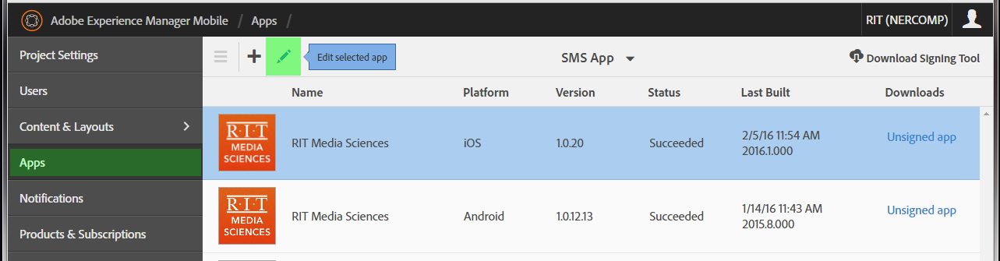
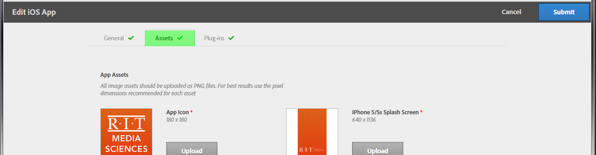
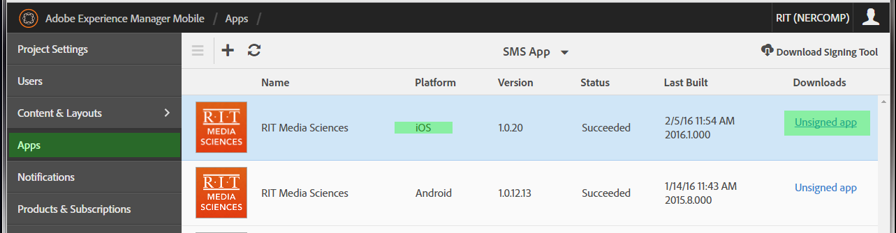
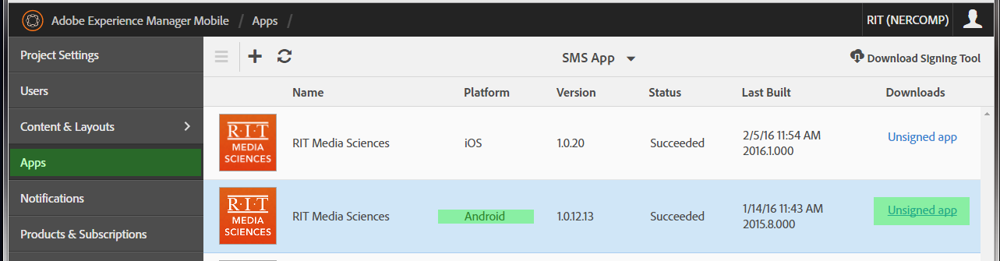

Instructions on how to create the certificates and gather the necessary files to submit applications to the Apple Appstore and the Google Play Store.

 
##Apple Appstore Submission
####Required Components
1. A 'p12' **distribution** certificate \***instructions below** (important that it is a **distribution** certificate if you are actually submitting to the appstore)

2. A password for the 'p12' (choose pass when you create the 'p12' cert...if you don't know the password and can't find it then you will have to make the 'p12' again --- I would recommend writing the passwords in a text file and storing on server because there is no way in God's lovely green smoky earth that you will remember the pass like a week after you make the certificate)

3. A **distribution** mobile provision file \***instructions below** (important that it is a **distribution** mobile provision file if you are actually submitting to the appstore)

4. 'Splashscreens' that the user sees on iOS devices when the app is loading (**upload these on the Adobe AEMM portal before downloading 'ipa' file**)
  1. 
  
  2. 

5. An 'ipa' file (download from Adobe AEMM web portal)

  1. 

6. A 'png' of the app icon that matches the resolution requirements of the Apple developer website (**has to be a png not a jpg!**, and has to be flattened png with no transparencies)

7. Screenshots of the app for each device resolution that Apple requires (take screenshots with available iOS devices and then use photoshop to crop to different device resolutions that we don't have --- [check here for specific device resolutions](https://developer.apple.com/library/ios/documentation/LanguagesUtilities/Conceptual/iTunesConnect_Guide/Appendices/Properties.html#//apple_ref/doc/uid/TP40011225-CH26-SW2)

####Instructions for iOS Certificate Creation and Signing
  - [Best Video Instructions on YouTube](https://www.youtube.com/watch?v=Xh2nnjttOwo)
  - [Best PDF Instructions](appstore_ios/guide-to-iOS-certificate-creation.pdf)
  
  - *Secondary Sources for More Info*:
    - https://www.youtube.com/watch?v=HlRI30F6-Ek
    
    - https://developer.apple.com/library/ios/documentation/IDEs/Conceptual/AppDistributionGuide/Troubleshooting/Troubleshooting.html#//apple_ref/doc/uid/TP40012582-CH5-SW2
    
    - https://appfurnace.zendesk.com/entries/22379207-How-do-I-create-p12-and-mobileprovision-files-for-iPhone-publishing-

####Developer Details
  - **URL**: https://itunesconnect.apple.com/ (sign in then click 'my apps')

  - **Username**: request developer account with existing Apple ID, then get Bob Fleck to add you to RIT's main dev account
   
  - **Password**: *unique to your account unless you make Apple ID for smsconnect* 
  
 
 
##Google Play Submission 
####Required Components
1. A 'p12' certificate \***instructions below**

2. A password for the 'p12' (choose pass when you create the 'p12' cert...if you don't know the password and can't find it then you will have to make the 'p12' again --- I would recommend writing the passwords in a text file and storing on server because there is no way in Satan's hard unforgiving hell that you will remember the pass like a week after you make the certificate)

3. An 'apk' file (download from the AEMM portal) 
  1. 
  
4. Graphics required by Google: Hi-res icon (512 x 512 png) and Feature Graphic (1024w x 500h jpg or png) + other optional graphics (upload graphics in developer console online)

####Instructions for Android Certificate Creation and Signing
  - [Instructions for creation on a Mac](googleplay_android/android-keystore-creation_mac.png)
  
  - [Instructions for creation using Windows](googleplay_android/android-keystore-creation_windows.png)

####Developer Details
  - **URL**: https://play.google.com/apps/publish/

  - **Username**: ritsmsconnect@gmail.com (log into gmail account then go to URL above)
  
  - **Password**: *located on server* 
  

